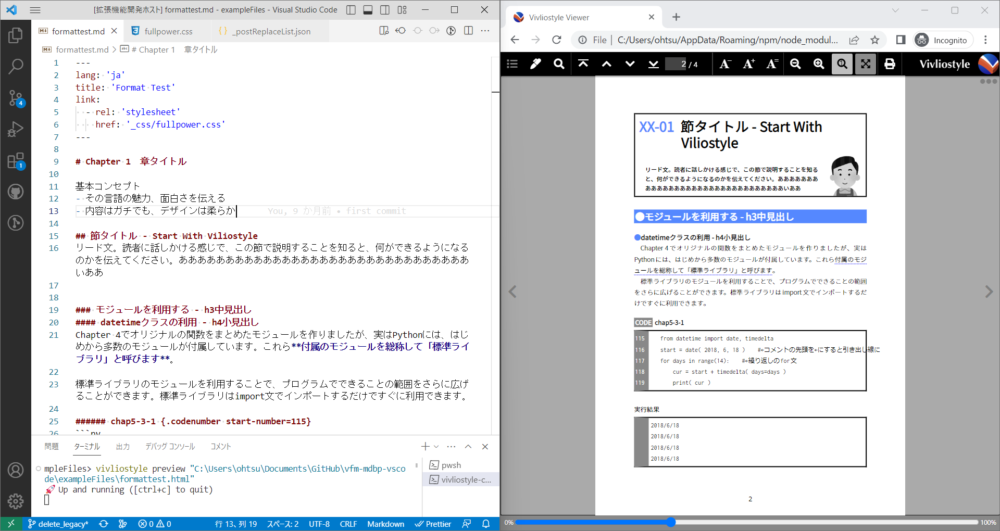
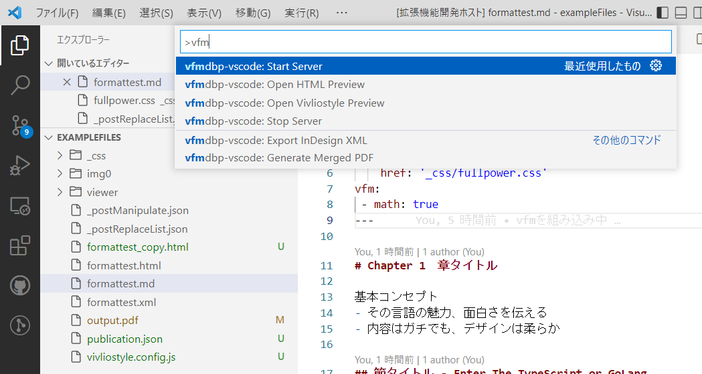

# vfm-mdbp-vscode README
MDBP（MarkDown-Book-Preview）は書籍の原稿作成に適したMarkdownプレビューの機能拡張です。 [Vivliostyle Viewer](https://vivliostyle.org/download/)と組み合わせて書籍の体裁で表示し、原稿データをInDesign向けのXMLファイルとして書き出す機能を持ちます。

MarkdownパーサーをVFM（Vivliostyle Flavored Markdown）に変更したバージョンです。

https://vivliostyle.github.io/vfm/#/ja/vfm

https://github.com/vivliostyle/vfm

## Features
- 任意の組版用CSSを読み込める
- 置換リストを使用してHTML変換後にテキスト置換を行える。これはMarkdownの不足を補うために使用する
- 画像ファイル名にsvgimgという拡張指定を追加すると、スクリーンショットの拡大縮小やトリミングが行える
- HTMLを実ファイルとして書き出すので、簡易的なHTML生成ツールとしても使用できる
- Vivliostyle Viwerを使用した書籍プレビューが可能
- ファイルの更新を監視してプレビューを更新するため、別のテキストエディタで作業しビューワとしてのみ使うことも可能





### 事前準備
1. 読み込むCSSファイルを指定するには、Markdownファイルの先頭にFrontmatterを書きます。
https://vivliostyle.github.io/vfm/#/vfm#frontmatter

##### Frontmatterの例
```md
---
lang: 'ja'
title: 'Format Test'
link:
  - rel: 'stylesheet'
    href: '_css/fullpower.css'
vfm:
 - math: true
---
```


2. フォルダ内にVivliostyle Viewerのviwerフォルダを配置してください。

- Vivliostyle Viewerのダウンロード
https://vivliostyle.org/download/

## How to Use
1. まずVSCodeでフォルダーを開いてください。そこがWebサーバーのルートになります。
2. フォルダー内のMarkdownファイルを開き、コマンドパレットで、Start Serverを選択します。
3. Open HTMLまたはVivliostyle Previewを選択すると、Webブラウザでプレビューが表示されます。
4. あとはフォルダー内（サブフォルダーも含む）でファイルの更新が発生すると、自動的にWebブラウザのプレビューが更新されます。※フォルダー内を監視しているので、VSCode以外でファイルを保存した場合でも更新されます。

### Start Server / Stop Server
プレビュー用のLive Serverを起動／終了します。

### Open HTML preview
CSSを適用したHTMLをVivliostyleを使わずに表示します。ページ区切りを気にせずに原稿を書きたいときに使います。

### Open Vivliostyle Preview
Vivliostyleを使って書籍風に表示します。

### PDFの印刷
PDFを出力したい場合は、Webブラウザ側の印刷機能を利用します。Chromeを利用する場合は、「送信先」を「PDFに保存」、「余白」を「なし」、「背景のグラフィック」をオンにしてください。


### Generate Merged PDF（テスト機能）
Vivliostyle CLIを使ってHTMLを連結して書き出します（事前にVivliostyle CLIのインストールが必要な機能です）。

vivliostyle.config.jsというファイルを作業フォルダ内のルートに作って、読み込みhtmlファイルを指定する必要があります。

##### vivliostyle.config.jsの例
```
// @ts-check
const vivliostyleConfig = {
  entry: [
    // mdを指定するとMDBPの独自仕様部分と画像類が外れる
    'intro.html',
    'chapter1.html',
    'chapter2.html'
  ], 
  output: [
    './merged_output.pdf',
  ],
};

module.exports = vivliostyleConfig;
```

Vivliostyle CLIの仕様ではentryセクションにMarkdownファイルも指定できますが、VFMでのHTML変換しか行われないため、MDBPが処理している部分が反映されません。MDBPが生成したHTMLファイルを指定するのを推奨します。

https://docs.vivliostyle.org/ja/vivliostyle-cli#%E6%A7%8B%E6%88%90%E3%83%95%E3%82%A1%E3%82%A4%E3%83%AB-vivliostyleconfigjs


### Export InDesign XML（未テスト）
InDesignの［構造］パネルで読み込み可能なXMLファイルを書き出します。XMLタグを任意のスタイルとマッピング可能です。また、画像のリンクを活かした自動配置、InDesign上のスクリプトと組み合わせた表の自動作成が可能です。


### 置換リスト
置換リストは`_postReplaceList.json`というJSONファイル内に記述します。

以下の置換リストは「@div クラス名」と「@divend」で囲んだ範囲を、div要素に置換します。また、ハイフンで生成する水平線は改ページ指定として処理します。
```
[
    {
        "f": "@div:([a-z|0-9 ]+)",
        "r": "<div class=\"$1\">"
    },
    {
        "f": "@divend",
        "r": "<\/div>"
    },
    {
        "f": "<hr>",
        "r": "<hr class=\"pagebreak\">"
    },
……後略……
```

### 画像のトリミング
IT書でスクリーンショットは欠かせません。いちいちグラフィックスソフトでトリミングしたり、拡大縮小率を厳密に指定するのは手間なので、画像ファイル名のあとに簡単な指示を入れることで、指定できるようにしました。

```


?svgimg=倍率,横幅mm,高さmm,横シフト量mm,縦シフト量mm
```

倍率以外のパラメータは省略可能です。幅と高さは省略時なりゆき、シフト量は0となります。

### その他
ゲタ文字〓を使用して連番を自動生成できます。

### postManipulate（後操作）機能
Markdownの記述を簡単にするために、デザイン都合でHTML構造を自動変更する機能を追加しました。h2見出しと直後のp要素を、装飾用の\<div:secheader\>～\</div\>で囲むといった操作を行えます。jQueryに似た機能を持つcheerioというライブラリを利用しています。

操作内容は_postManipurate.jsonというファイルに「セレクタ」「メソッド」「パラメータ」を指定する形にしているので、プロジェクトごとに設定変更が可能です。
```
[
  {
    "selector": "h1",
    "method": "wrapWithNextSib",  // h1要素とその次の1要素をdiv.coverpageでラップする（見出しとリード文のグループ化）
    "paramator": "<div class=\"coverpage\"></div>"
  },
  {
    "selector": "h2",
    "method": "wrap",     // h2要素をdiv.secheaderでラップする（h2要素に装飾用のdivを追加）
    "paramator": "<div class=\"secheader\"></div>"
  },
    "selector": "h3",
    "method": "wrapAll",  // h3要素の直後にある複数のp要素をすべてdiv.col2でラップする（見出しの下の段落を2段組みに）
    "paramator": ["p", "<div class=\"col2\"></div>"]
  },
  {
    "selector": "h2",
    "method": "dupRunning",  // h2要素のテキストを複製してspan.header2という要素を作成する（柱テキストの作成）
    "paramator": "<span class=\"header2\"></span>"
  },
    "selector": "p code",
    "method": "addClass",  // p要素内のcode要素にinline_codeというクラスを追加する
    "paramator": "inline_code"
  },
]
```

### Vivliostyle CLIのサポート（v0.1.5より追加）
コマンドパネルより、mdbp-vscode: Open Viviostyle Preview CLIを選択すると、Vivliostyle CLIによるプレビューを利用できます。
Node.jsとVivliostyle CLIのインストールが別途必要ですが、原稿フォルダにViewerを用意したり（ViewerのバージョンはVivliostyle CLIのバージョンに依存）、サーバーを起動したりする必要がなくなります。

https://docs.vivliostyle.org/ja/vivliostyle-cli

vivliostyle.config.jsを用いた複数ファイル書き出しも可能になりました。

## Requirements
- VSCode 1.69.0以上
- 作業フォルダー内にVivliostyle viewerが必要です。
- TCP8087ポートを使用します。

## Known Issues
- CLIでプレビュー／ビルドを行う場合、本来はViewerは不要ですが、変換コードの一部がViewerの有無をチェックするため、エラーが発生します。

## Release Notes

Users appreciate release notes as you update your extension.

### 0.1.10
空のp要素をムリヤリ削除する処理を追加。
### 0.1.9
CLIからPDFを出力する際に、原稿のファイル名をPDFファイル名に使用する


### 0.1.8
実験的なソースコードの連番機能。

コードの前に次の形式で書くと、直後のpre &gt; code内を改行コードで分割し、`<span class="codenum-elem">000</span>`を追加する。
```
###### sampe1.html {.codenumber start-number=15}
`` `
コード
コード
コード
`` `
```

**VFMがv2になってsection要素の扱いが変わったときに、修正の必要がある**。

### 0.1.7
コマンドパレットでオリジナルのMDBPと混同しないようコマンドのカテゴリ名を変更

### 0.1.6
Vivliostyle CLIを利用したPDF書き出しを追加

### 0.1.5
プレビュー更新をmdbp-vscode 0.1.5に合わせて修正

### 0.1.0
最初のリリース

-----------------------------------------------------------------------------------------------------------

(c)libroworks.co.jp
http://libroworks.co.jp/
