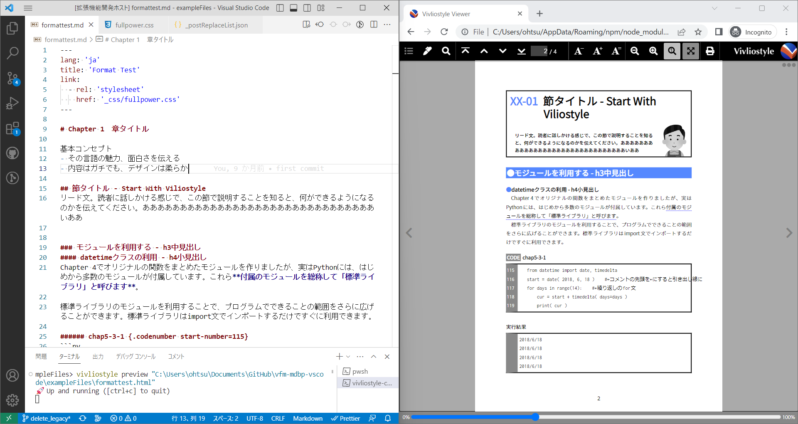
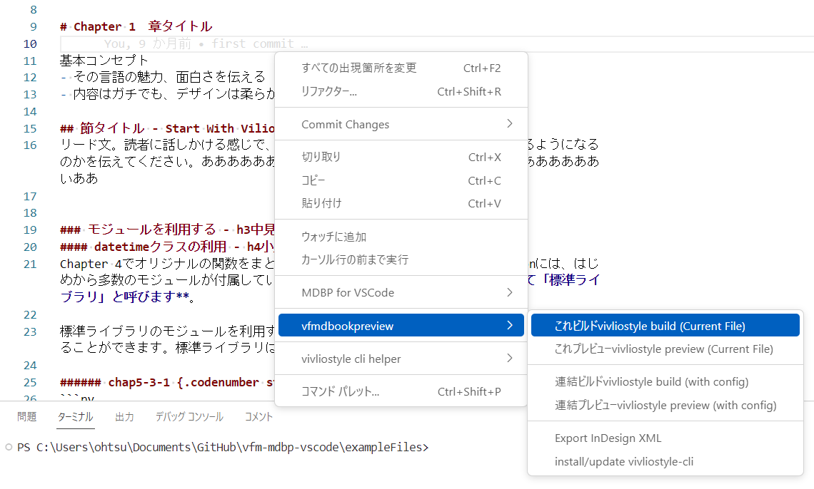

# vfm-mdbp-vscode README
MDBP（MarkDown-Book-Preview）は書籍の原稿作成に適したMarkdownプレビューの機能拡張です。 [Vivliostyle](https://vivliostyle.org/download/)と組み合わせて書籍の体裁で表示し、原稿データをInDesign向けのXMLファイルとして書き出す機能を持ちます。

[『Web技術で「本」が作れるCSS組版 Vivliostyle入門』（リブロワークス著，Vivliostyle監修，C&R研究所2023年5月刊）](https://www.c-r.com/book/detail/1493)のために作成した，vivliosytle-cli-helperに，独自機能を盛り込んだものです。

## Features
- 組版用CSSによって書籍のリアルタイムプレビュー，PDF書き出しを行える
- 置換リストを使用してHTML変換後にテキスト置換を行える。これはMarkdownの不足を補うために使用する
- 画像ファイル名にsvgimgという拡張指定を追加すると、スクリーンショットの拡大縮小やトリミングが行える
- 簡易的にソースコードに行番号を振る機能を加えている
- Adobe InDesignの構造ウィンドウで読み込み可能なXMLファイルを書き出せる





## 事前準備
1. Vivliostyle CLIの実行に必要なNode.jsをインストールします。バージョン16以上の安定版をインストールしてください。<br>
[Node.js日本語ページ](https://nodejs.org/ja)


2. ターミナルから以下のコマンドを実行してVivliostyle CLIの最新版をインストールします。これはMDBPの右クリックメニューからも実行できます。

```
npm install -g @vivliostyle/cli
```

## 基本的な使い方
1. VSCodeでフォルダーを開いてください。そこがWebサーバーのルートになります。
2. フォルダー内のMarkdownファイルを開き、右クリックして［これプレビューvivliostyle preview (Current File)］を選択します。
3. あとはフォルダー内（サブフォルダーも含む）でファイルの更新が発生すると、自動的にWebブラウザのプレビューが更新されます。※フォルダー内を監視しているので、VSCode以外でファイルを保存した場合でも更新されます。
4. プレビューを停止したい場合は，VSCodeのターミナルをクリックして，Ctrl + C（macOSはcontrol + C）キーを押します。
5. 読み込むCSSファイルを指定するには、Markdownファイルの先頭にFrontmatterを書きます。

##### Frontmatterの例
```md
---
lang: 'ja'
link:
  - rel: 'stylesheet'
    href: '_css/fullpower.css'
---
```

この動作はVFM（Vivliostyle Fravored Markdown）の仕様に基づくものです。詳しくは解説ページを参照してください。

https://vivliostyle.github.io/vfm/#/vfm#frontmatter

https://vivliostyle.github.io/vfm/#/ja/vfm

https://github.com/vivliostyle/vfm


## コマンド解説
### ▶［これビルドvivliostyle build (Current File)］
現在エディタで開いているMarkdownまたはHTMLファイルをもとに，Vivliostyleを使ってPDFを書き出します。Markdownファイルの拡張子を変えたPDFが，同じ階層に書き出されます。

プレビューを実行している場合は，いったんCtrl + C（macOSはcontrol + C）キーで中止してください。

### ▶［これプレビューvivliostyle preview (Current File)］
現在エディタで開いているMarkdownまたはHTMLファイルをもとに，Vivliostyleを使って紙面のプレビューを表示します。

### ▶［連結ビルドvivliostyle build (with config)］
vivliostyle.config.jsに指定したHTMLファイルを連結して，PDFを書き出します。vivliostyle.config.jsは作業フォルダ内のルートに作ってください。

##### vivliostyle.config.jsの例
```
module.exports = {
  entry: [
    // mdを指定するとMDBPの独自仕様処理が行われない
    'intro.html',
    'chapter1.html',
    'chapter2.html'
  ],
};
```

Vivliostyle CLIの仕様ではentryセクションにMarkdownファイルも指定できますが、VFMでのHTML変換しか行われないため、MDBPの独自処理が反映されません。HTMLファイルのみ指定してください。

Markdown変換が必要な場合は，vivliostyle.mdbplist.jsonを記述し，変換したいMarkdownファイル名を列挙してください。vivliostle previewまたはbuildの実行前に，MDBPによるMD→HTML変換がまとめて行われます。

###### vivliostyle.mdbplist.jsonの例
```
["intro.md", "chapter1.md", "chapter2.md"]
```


### ▶［連結プレビューvivliostyle preview (with config)］
vivliostyle.config.jsに指定したHTMLファイルを連結して，プレビューを表示します。使用方法は連結ビルドと同じです。


### ▶［Export InDesign XML］
InDesignの［構造］パネルで読み込み可能なXMLファイルを書き出します。

### ▶［install/update vivliostyle-cli］
Vivliostyle CLI最新版のインストールを行います。ターミナルから以下のコマンドを実行するのに相当します。

```
npm install -g @vivliostyle/cli
```


## その他の機能
### 置換リスト
置換リストは`_postReplaceList.json`というJSONファイル内に記述します。

以下の置換リストは「@div クラス名」と「@divend」で囲んだ範囲を、div要素に置換します。また、ハイフンで生成する水平線は改ページ指定として処理します。
```
[
    {
        "f": "@div:([a-z|0-9 ]+)",
        "r": "<div class=\"$1\">"
    },
    {
        "f": "@divend",
        "r": "<\/div>"
    },
    {
        "f": "<hr>",
        "r": "<hr class=\"pagebreak\">"
    },
……後略……
```
サンプル置換リスト

https://gist.github.com/lwohtsu/7abb3f9e1a1c8e06b600f8ef915a10e7

### 画像のトリミング
IT書でスクリーンショットは欠かせません。いちいちグラフィックスソフトでトリミングしたり、拡大縮小率を厳密に指定するのは手間なので、画像ファイル名のあとに簡単な指示を入れることで、指定できるようにしました。

```


?svgimg=倍率,横幅mm,高さmm,横シフト量mm,縦シフト量mm
```

倍率以外のパラメータは省略可能です。幅と高さは省略時なりゆき、シフト量は0となります。

### その他
ゲタ文字〓を使用して連番を自動生成できます。

### postManipulate（後操作）機能
Markdownの記述を簡単にするために、デザイン都合でHTML構造を自動変更する機能を追加しました。h2見出しと直後のp要素を、装飾用の\<div:secheader\>～\</div\>で囲むといった操作を行えます。jQueryに似た機能を持つcheerioというライブラリを利用しています。

操作内容は_postManipurate.jsonというファイルに「セレクタ」「メソッド」「パラメータ」を指定する形にしているので、プロジェクトごとに設定変更が可能です。
```
[
  {
    "selector": "h1",
    "method": "wrapWithNextSib",  // h1要素とその次の1要素をdiv.coverpageでラップする（見出しとリード文のグループ化）
    "paramator": "<div class=\"coverpage\"></div>"
  },
  {
    "selector": "h2",
    "method": "wrap",     // h2要素をdiv.secheaderでラップする（h2要素に装飾用のdivを追加）
    "paramator": "<div class=\"secheader\"></div>"
  },
    "selector": "h3",
    "method": "wrapAll",  // h3要素の直後にある複数のp要素をすべてdiv.col2でラップする（見出しの下の段落を2段組みに）
    "paramator": ["p", "<div class=\"col2\"></div>"]
  },
  {
    "selector": "h2",
    "method": "dupRunning",  // h2要素のテキストを複製してspan.header2という要素を作成する（柱テキストの作成）
    "paramator": "<span class=\"header2\"></span>"
  },
    "selector": "p code",
    "method": "addClass",  // p要素内のcode要素にinline_codeというクラスを追加する
    "paramator": "inline_code"
  },
]
```

### ソースコードに行番号を付ける機能
コードの前に次の形式で書くと、直後のpre &gt; code内を改行コードで分割し、`<span class="codenum-elem">000</span>`を追加する。
```
###### sampe1.html {.codenumber start-number=15}
`` `
コード
コード
コード
`` `
```


## Requirements
- VSCode 1.100.0以上
- Node.js v20以上


## Release Notes
### 0.3.0（0.2.10）
VFM2.5にアップデート

### 0.3.0（0.2.10）
HTMLだけを更新する機能を追加（VFMだけ使用）

### 0.2.9
暫定処理として8.xより上がインストールされないよう固定

### 0.2.8
vfmを2.2.1にアップデート


### 0.2.7
コミットし忘れ対応


### 0.2.6
VFMを2.2.0にアップデート

non-sectionized見出しに対応
```
#### sectionized見出し
テキスト

####    <!--同じ数の#の行を書くと、ここでセクションを終了できる-->


#### non-sectioneze見出し{.クラス} ####　<!--末尾に同じ数の#を書くと、セクションを生成しない-->
```


### 0.2.5
書き出したXMLのインデントを削除


### 0.2.4
XML書き出し時のクラス名のバグを修正


### 0.2.3
画像のリンク切れ時にメッセージを表示するよう改良

連結プレビュー，連結ビルドを実装

### 0.2.2
ドキュメントが更新できていなかったので，マイナーアップデート。

### 0.2.0
大幅変更。vivliostyle CLIに依存する形に変更し，独自のLive Serverを削除。
機能をシンプルにするよう調整。ひとまず「これプレビュー」など最低限の機能を使えるように実装。

連結プレビュー，連結ビルド機能は実装中。


### 0.1.11
VFMを2.1.0にアップデートし、連番機能を修正

### 0.1.10
空のp要素をムリヤリ削除する処理を追加。
### 0.1.9
CLIからPDFを出力する際に、原稿のファイル名をPDFファイル名に使用する


### 0.1.8
実験的なソースコードの連番機能。


### 0.1.7
コマンドパレットでオリジナルのMDBPと混同しないようコマンドのカテゴリ名を変更

### 0.1.6
Vivliostyle CLIを利用したPDF書き出しを追加

### 0.1.5
プレビュー更新をmdbp-vscode 0.1.5に合わせて修正

### 0.1.0
最初のリリース

-----------------------------------------------------------------------------------------------------------

(c)libroworks.co.jp
http://libroworks.co.jp/
